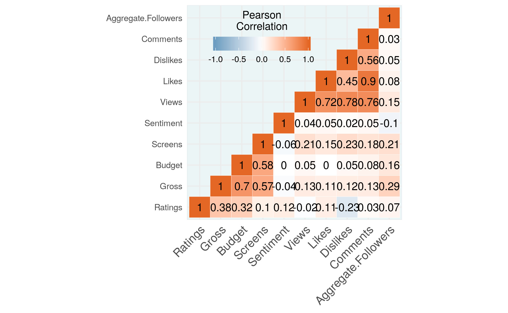
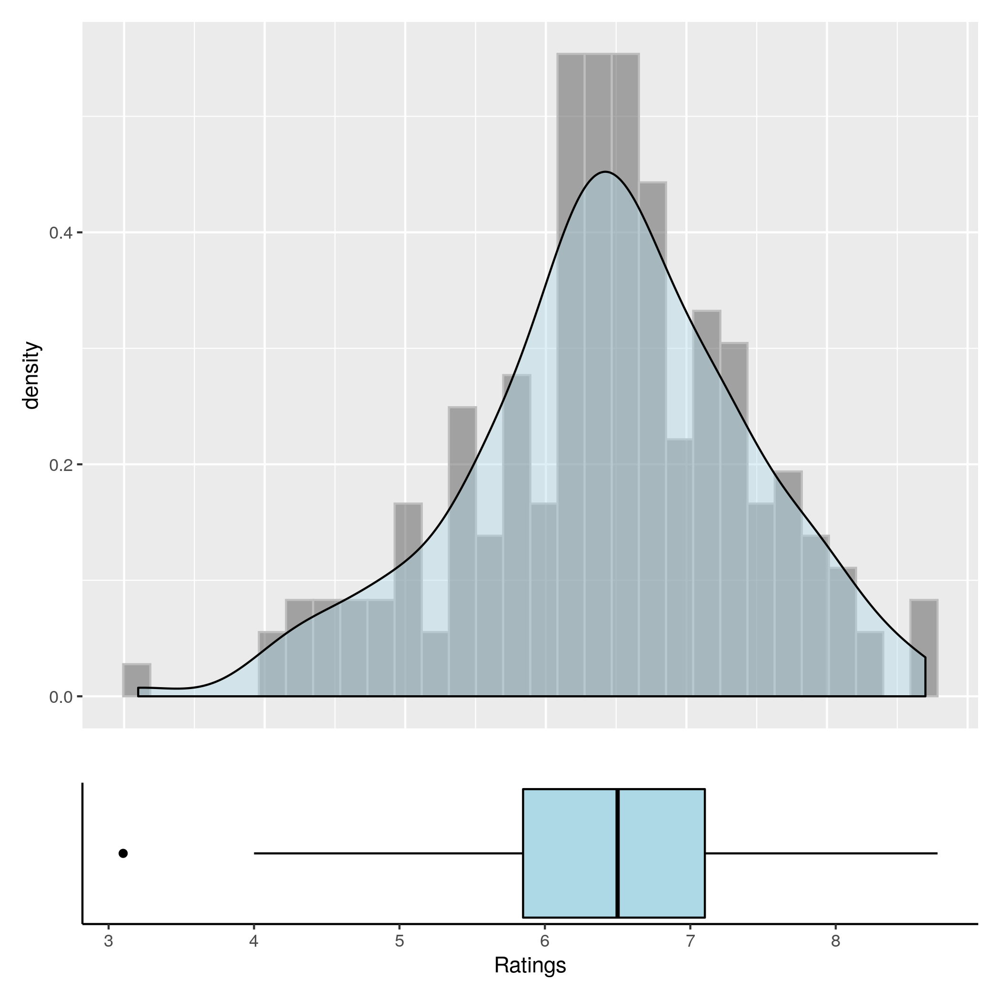
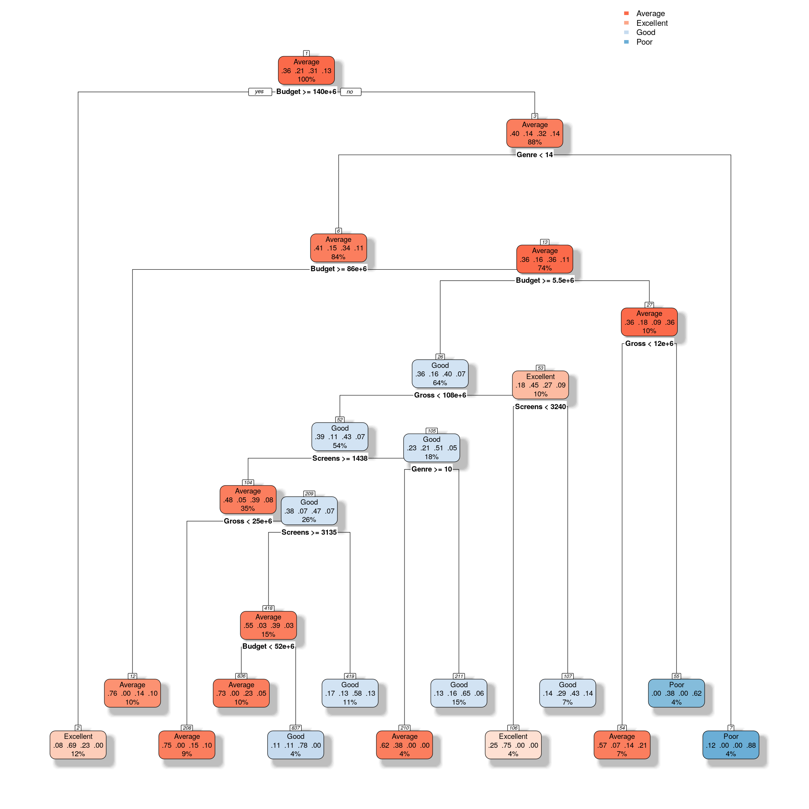
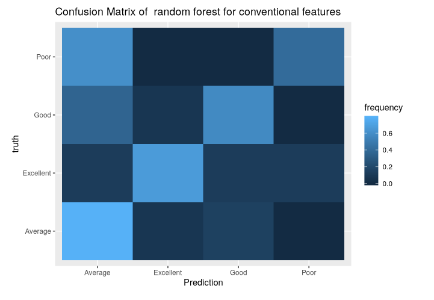
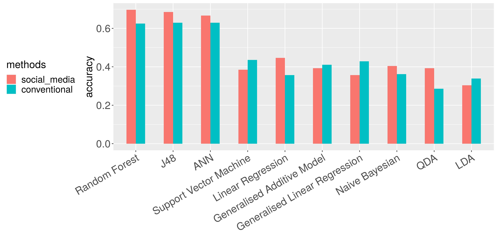

# EECS-E6690-final-project

Final project for EECS E6690 Statistical learning @ Columbia University

## Introduction

This is the EECS 6690 final project of Statistical Learning. Our goal is to do a comprehensive review of a
machine learning paper, try to reproduce the results of the original paper by recreating all the model using R code,
think about new models or methods that can be applied to the dataset, and document the project and our results,
including the comparison and reasons behind the results between ours and original paper’s. 


## Structure
All the main codes are writen in R language. You can check all `.Rmd` and `.R`
files for details.

```
.
├── data # data set storage
├── doc # documentation
├── figures # all figures in data visualization and analysis
├── methods # all methods applied in this project
├── LICENSE
└── README.md
```


## Method
The original paper
is about predicting the popularity of movies. A number of attributes such as cast, genre, budget, production house,
and rating affect the popularity of a movie. Social media such as Twitter, YouTube etc. are major platforms where
people can share their views about the movies. The original paper uses Linear Regression and J48 tree to do the
prediction based on the above two kinds of features (conventional features and social media features). We reproduce
the results and try other methods that also successfully predict the popularity of movies, including Support Vector
Machine, Naive Bayesian Model, LDA & QDA, Artificial Neural Network, Random Forest. At last, we make a
comparison between all of these methods, and discuss about the profound nature behind the results.

Here are some plots for data visualization and analysis in our procedure.

- Data Visualization:




- Analysis



## Evaluation ans Comparison

| Methods | Conventional Features | Social Media Features |
| :----: | :-----: | :------:|
| Linear Regression | 0.358 | 0.446 |
| Generalized Additive Model | 0.411 | 0.393 |
| Generalised Linear Regression | 0.429 | 0.357 |
| LDA | 0.339 | 0.303 |
| QDA | 0.285 | 0.393 |
| Naive Bayesian | 0.362 | 0.404 |
| Support Vector Machine | 0.436 | 0.385 |
| ANN | 0.630 | 0.667 |
| Random Forest | 0.625 | 0.693 |
| J48 | 0.629 |  0.685 |



## Documentation

All the details of project are presented in presentation slides and report. 
If you are interested in our project, you can check it for details.

- [Presentation Slides](https://docs.google.com/presentation/d/18lz5sqOB89zLfCIxd0eHwVtLrByeYrlfDFwNO6LWtFc/edit?usp=sharing
) [PDF Version](doc/EECS6690_presentation.pdf)
- [Report](doc/EECS6690_final_report.pdf)


## Citation
- [Ahmed M, Jahangir M, Afzal H, Majeed A, Siddiqi I. Using Crowd-source based 
features from social media and Conventional features to predict the movies popularity. 
InSmart City/SocialCom/SustainCom (SmartCity), 2015 IEEE International Conference on 2015 Dec 19 (pp. 273-278). IEEE.](
https://www.semanticscholar.org/paper/Using-Crowd-Source-Based-Features-from-Social-Media-Ahmed-Jahangir/c6c01381cadf95b14486fe80f6d898ddb3c0ec15)
- [CSM (Conventional and Social Media Movies) Dataset 2014 and 2015 Data Set](
https://archive.ics.uci.edu/ml/datasets/CSM+%28Conventional+and+Social+Media+Movies%29+Dataset+2014+and+2015)

## Contact

- [Chong Hu](https://github.com/JackSnowWolf) UNI: ch3467
- [Chen Wenjie](https://github.com/JACKCHEN96) UNI:  wc2685
- [Zhang Haoran](https://github.com/Headnerd9798) UNI: hz2619